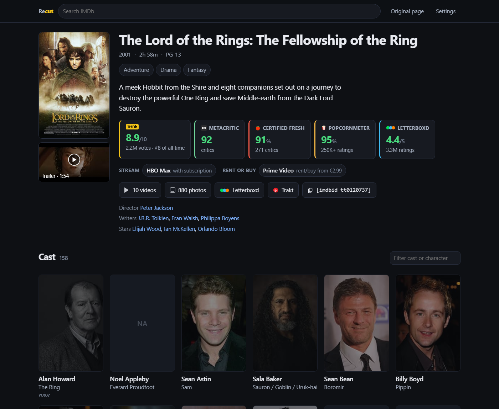
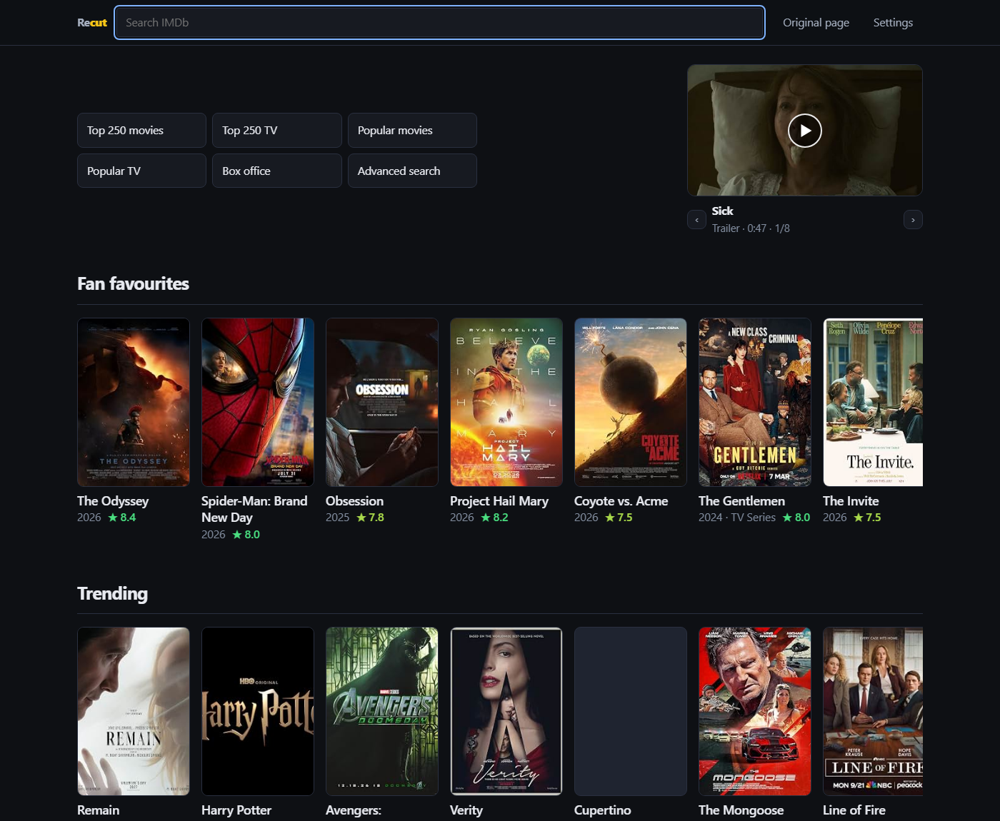
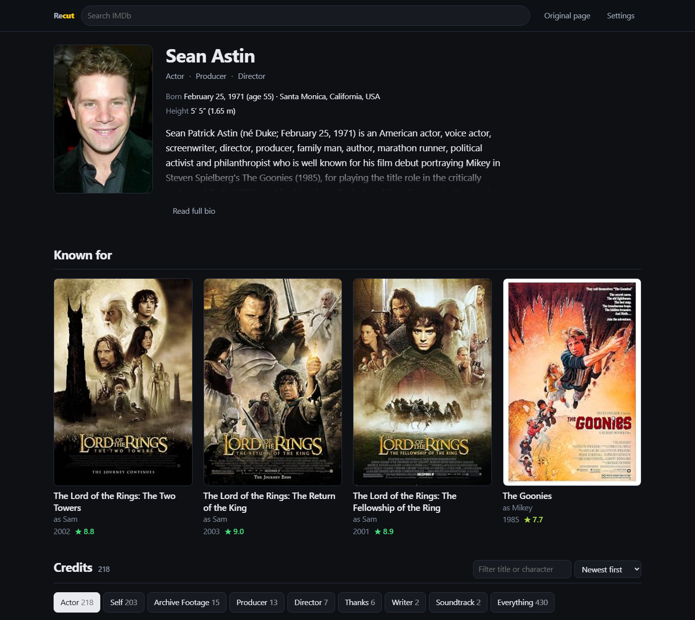
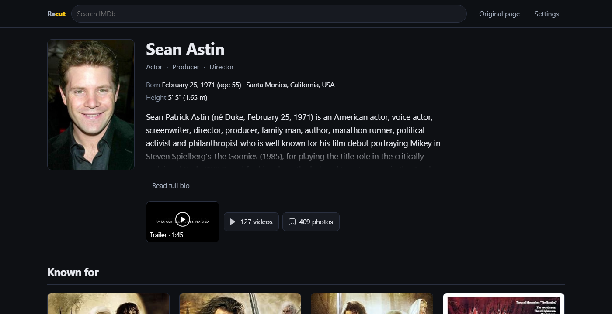
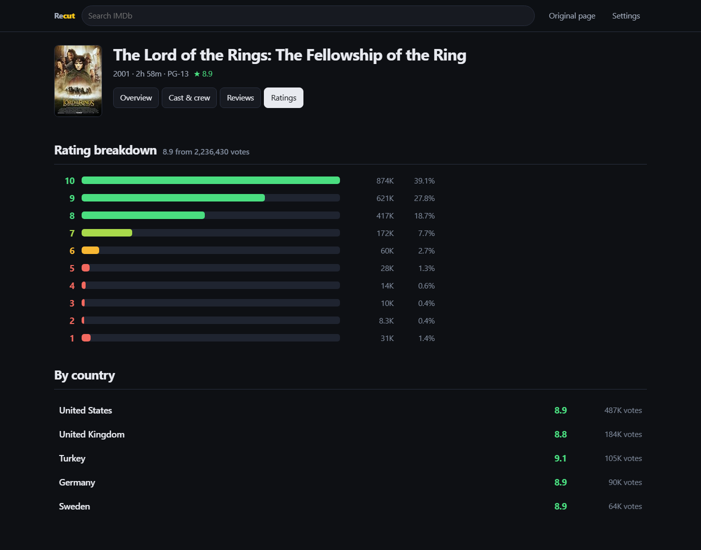
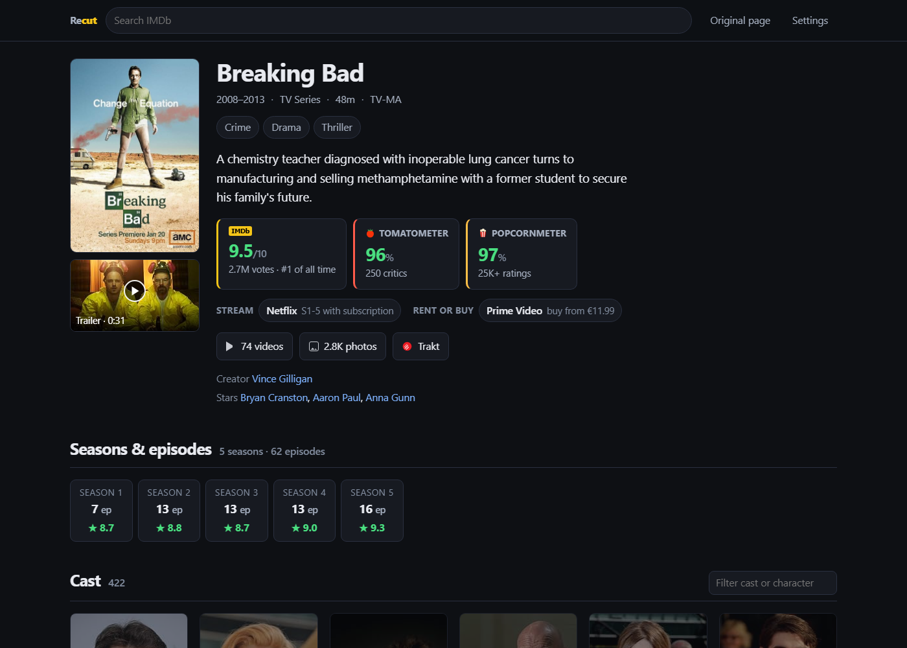
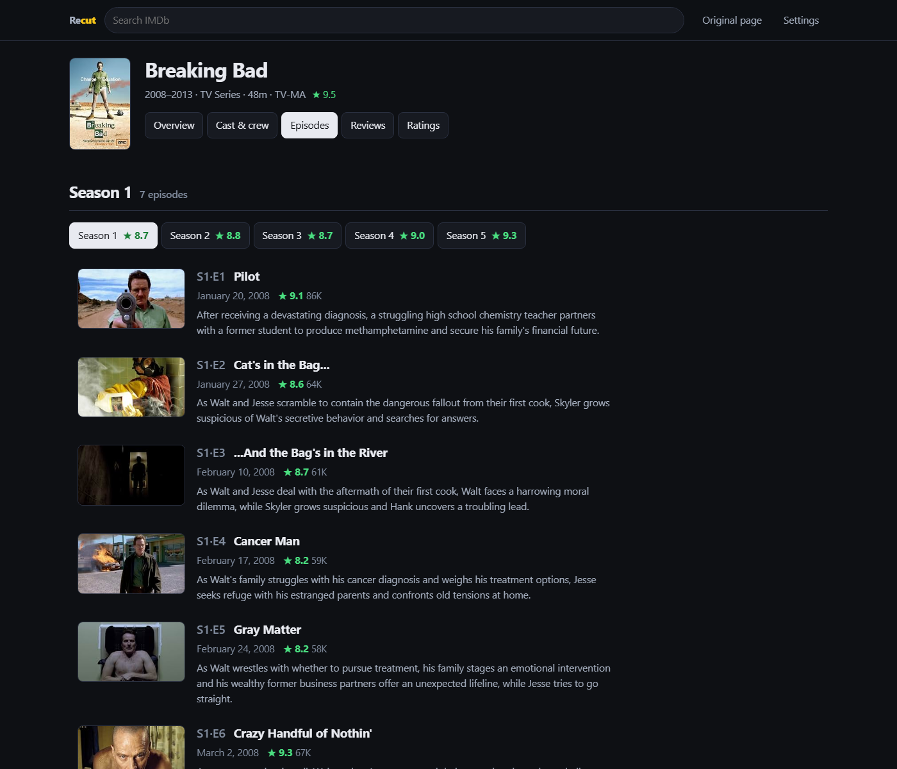
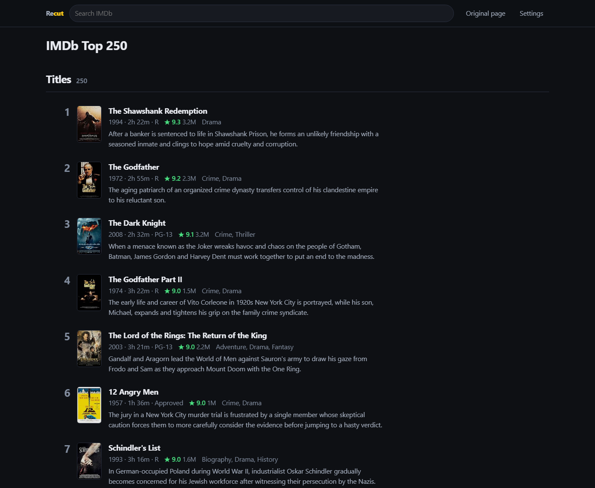
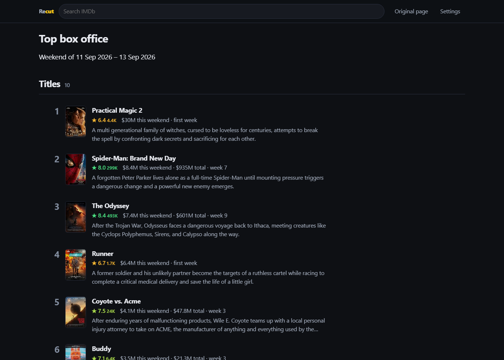

# Recut for IMDb

A userscript that rebuilds IMDb's pages from IMDb's own data: cast with the
characters played, complete filmographies, ratings from five sources, where to
watch — and none of the ads, players, carousels or upsells.

It doesn't hide IMDb's markup with CSS. It reads the page's data payload and
renders its own layout, so the clutter is never built in the first place.

## Install

**1. Get a userscript manager**

| | Chrome / Brave / Vivaldi | Firefox | Edge | Safari |
| --- | --- | --- | --- | --- |
| **Tampermonkey** | [install](https://chromewebstore.google.com/detail/tampermonkey/dhdgffkkebhmkfjojejmpbldmpobfkfo) | [install](https://addons.mozilla.org/firefox/addon/tampermonkey/) | [install](https://microsoftedge.microsoft.com/addons/detail/tampermonkey/iikmkjmpaadaobahmlepeloendndfphd) | [install](https://apps.apple.com/app/tampermonkey/id1482490089) |
| **Violentmonkey** | [install](https://chromewebstore.google.com/detail/violentmonkey/jinjaccalgkegednnccohejagnlnfdag) | [install](https://addons.mozilla.org/firefox/addon/violentmonkey/) | [install](https://microsoftedge.microsoft.com/addons/detail/violentmonkey/eeagobfjdenkkddmbclomhiblgggliao) | — |

**2. → [Install Recut](https://github.com/MohsenBlur/imdb-recut/raw/main/recut.user.js) ←**

Your manager will intercept that link and offer to install. Open any IMDb page.
On first use it asks permission to reach `api.graphql.imdb.com`,
`query.wikidata.org`, `rottentomatoes.com`, `letterboxd.com` and `trakt.tv` —
that's the ratings, links and full cast/credits data. Decline any of them and
the page still works, with less on it.

Everything that puts something on screen has a toggle in **Settings** (top bar),
including the homepage takeover, so it can be cut back further than the defaults.
**Original page** in the top bar shows you IMDb's real page instantly.

---



## What it covers

| Page | What you get |
| --- | --- |
| `/title/tt…` | IMDb, Metascore, Tomatometer, Popcornmeter and Letterboxd in one strip · where to watch in your country · trailer · full cast with characters · sortable user reviews · seasons with each one's episode count and rating · photos · more-like-this · Letterboxd and Trakt links |
| `/name/nm…` | Known-for, then the *complete* filmography with the character played on every row, category tabs, filter and sort |
| `…/ratings` `…/fullcredits` `…/episodes` `…/reviews` | Rating histogram and per-country breakdown · every cast and crew member · season tabs carrying their own ratings · the full review list |
| `/find` `/search/title` | Results as rows, plus type-ahead in the header |
| `/chart/…` `/list/ls…` | Top 250, the popularity charts, the weekend box office with each film's takings, user lists |
| `/` | Search, quick links, IMDb's own picks, trending and popular as single-line rows, and the hero trailer shrunk into the corner — without the news, promos and ads |

Every rating is colour-banded on one scale — **≥8.0 green · 7.0–7.9 lime ·
6.0–6.9 amber · below 6.0 red** — so a filmography can be skimmed without
reading numbers. Ratings from under 1,000 votes are dimmed, so an obscure 9.8
from 14 votes doesn't outshout a classic. The cookie banner is hidden and
**declined** on every IMDb page.

<details>
<summary>More screenshots</summary>










</details>

## How it works

1. **IMDb's page payload** (`__NEXT_DATA__`) — instant, no network, enough to
   paint the whole page.
2. **IMDb's public GraphQL API** for what the page withholds: the full cast (it
   ships ~18 of 158), the full filmography (15 per category), reviews,
   per-season episode counts, and where-to-watch. Cached to disk for six hours,
   bounded to 80 entries.
3. **Wikidata** maps the IMDb id to exact Rotten Tomatoes, Letterboxd and Trakt
   ids in one query, so nothing is matched by guessing at titles.

IMDb publishes no rating for a season, so each one is the mean of its own
episodes' ratings — every season of a show in a single request, which is what
turns a long-running series into a curve you can read at a glance. Seasons
listed but not yet aired show their episode count and no rating.

Where-to-watch is IMDb's own data, so there's no third party and no API key —
and since the request comes from your browser, it's already your country and
your currency. Requests go through `GM_xmlhttpRequest`, so page CSP and Rotten
Tomatoes' bot-detection wrapper around `window.fetch` don't apply. If the API is
unreachable the page still renders and says so, rather than quietly showing a
short list under a large number.

IMDb serves language-prefixed paths (`/de/title/…`). Those are recognised, and
every link keeps the prefix so you stay in your own language.

## Tests

The suites in `test/` slice the **real** functions out of `recut.user.js` — not
copies, so they fail when the script drifts — and run them against the live
services.

```bash
cd test && npm install && npm test
```

`load-test.mjs` executes the whole script in a synthetic DOM across twelve URLs;
`node --check` only parses, and this catches the errors that would kill it on
every page. The Rotten Tomatoes, Letterboxd and Trakt suites each include
**known-bad probes that must be refused**, not guessed.

`tools/shots.mjs` regenerates the screenshots by running the real script against
real IMDb data in headless Chrome. `test/preview.mjs` builds every component on
one page at any width — how the phone layout gets checked, since Chrome won't
make a window narrower than ~500px. `RECON.md` records what was measured about
these sites' data shapes, including what turned out to be wrong the first time.

## Limits

- IMDb's API is undocumented. If it changes, the extra data degrades to what the
  page payload holds and the page keeps working.
- Trakt returns HTTP 200 for every path including nonexistent ones, so its links
  can't be validated by fetching. The button appears only when Wikidata has a
  real id. Letterboxd is films-only; Trakt covers films, series and mini-series.
- Signed-in features (your ratings, watchlist) aren't carried over.
- On a language-prefixed page the layout follows your language, but titles from
  the API come back in English, so a filmography can mix the two.
- `/name/*/bio`, `/awards` and `/user/*` are still IMDb's own pages.

## Licence

MIT — see [LICENSE](LICENSE). Not affiliated with IMDb. Uses IMDb's public
endpoints for personal, non-commercial use.
